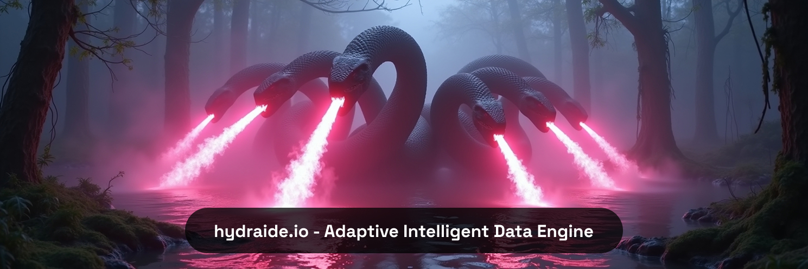

# 🧠 HydrAIDE Server – Runtime for the HydrAIDE Core

%20Always-ff69b4?style=for-the-badge)

> **HydrAIDE is a zero-waste, real-time data engine. Think: database meets reactive runtime – without the bloat.**

---

## 📦 Should I build this?

**Probably not.**

Unless you’re contributing to the core engine or maintaining a downstream fork,  
you don't need to build this manually.

> 🐳 The HydrAIDE Server is available as an official **Docker container**, precompiled and production-ready.

If you just want to run the engine or integrate it into your system,  
we recommend using the [Docker image](https://github.com/hydraide/hydraide) — no setup, no surprises.

---

## 🧪 When *should* I build this?

You only need to build this repo if you are:

- actively working on **HydrAIDE Core internals**,
- integrating the engine into your own Go-based backend,
- preparing **custom builds** for IoT or edge deployments,
- or need **deep debugging** on gRPC and streaming behavior.

For everyone else:  
**just use the Docker container.** It includes:

- the full HydrAIDE Core engine
- gRPC server
- service discovery
- logging, metrics, recovery features

👉 https://github.com/hydraide/hydraide

---

## 🛠️ Build / Installation Docs?

We don’t maintain install guides here.

Head over to the main project for usage, installation and deployment info:  
👉 **[hydraide/hydraide](https://github.com/hydraide/hydraide)**

That’s where:
- Docker usage is explained
- versioning & changelogs are tracked
- client SDKs and integrations are linked

---

## 🔐 License

This project is licensed under **SSPL v1.0 with commercial restrictions**.  
Read the [`LICENSE`](./LICENSE) file for details.

If you intend to offer HydrAIDE Server as a service, or embed it into commercial products,  
you must obtain a **commercial license**:

📧 [peter.gebri@trendizz.com](mailto:peter.gebri@trendizz.com)

---

## 👤 Authors

**Gebri Péter**  
Trendizz Systems  
📅 2025-07-18

